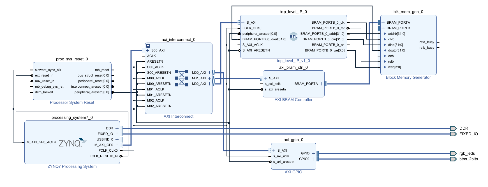

# In-Place iFFT implemented on a Zynq-7000

***WARNING**: this is a repository still under development as of February 2025. Please read the beginning of this [`README`](./ReadMe.md) and for the progress on the development refer to the ["Progress"](#progress) section.*

In this project is an implementation of an in-place FFT algorithm on the Programmable Fabric of a Zynq-7000 SoC. This FFT implementation is a burst architecture, where all the input data are stored in a BRAM. It is rather memory efficient, since it stores pairs of input points in a single memory word. Thus an N-point FFT requires N/2 memory words to store its data. The drawback is that for a 32-bit menory each datum is comprised of 16-bits and taking into account that half the datum is the real part and the other half is the imaginary, then each real or imaginary part of a datum is just 8-bits. For 64-bit memory word it is 16-bits. For the data representation Block-Floating-Points (BFPs) are uses and each datu, has the two most significant bits representing the integral part and the rest least significant bits representing the fractional part, for either 8-bit or 16-bit data. This memory compact, low precision FFT is suited to run on particularly in specialized edge applications that need to run a small footprint FFT, like for example on a sensor of a sattelite system.

I have already implemented this algorithm on the said SoC in the past, writing the [hdl of the IP in VHDL](./designs/vhdl_code/). From this older project a block design in the Xilinx Vivado 2022.2 synthesizer was generated, storing all the input points in a BRAM, which can be updated from the Processing System (PS) of the Zynq-7000. The FFT could initiate execution by writing in the proper registers, which consisted AXI4-Lite memory mapper interfaces. The test software was a baremetal application in Xilinx Vitis 2022.2. The tests where performed on the [Digilent Cora Z7S](https://digilent.com/reference/programmable-logic/cora-z7/start?srsltid=AfmBOorJSxlkoEdb184xk6KRAMLR1IdhanvYBHI2iip1K_6A1NP_HGTU) development board. The following image shows the old block design from Vivado 2022.2:

However the old VHDL design suffered (in my opinion) the following problems:
- large critical paths in the Control Unit resulted in maximum fabric clock speed of 100MHz.
- no use of helpful axi interfaces between the various instansiated entities.
- lack of assertion and verification constructs, not supported natively in VHDL.
- poor use of the Vivado IP Packager and AXI interfaces on the Block Design

The goal in this repository is to _rewrite the hdl of the FFT IP in SystemVerilog_ in order to achive _smaller critical paths_ and consequently _use a faster clock_ and also make use of the _verification constructs of SystemVerilog, as well as its interfaces_.

To navigate this repository each folder contains its own `readme` documentation.

## Progress

***Newly written hdl SystemVerilog modules***

- [ ] top level ip
  - [x] system memory (**must be active high reset**)
  - [x] twiddle rom
  - [x] processing element (_the following need the order shown_)
    - [x] shifter
      - [x] shift_unit 
    - [x] butterfly processor
      - [x] stage 0
      - [x] stage 1
      - [x] stage 2
    - [x] rounder
      - [x] rounding unit
    - [x] limiter
      - [x] limits_unit
    - [x] shamt_producer
        - [x] shamt_unit
          - [x] 8 bit section
          - [x] 16 bit section
    - [x] shamt decider
  - [ ] address generation unit (AGU)
  - [ ] control unit
  - [ ] register file
    - [x] data input dual registers
    - [ ] shift amount register with compare
    - [ ] shifts count register
- [ ] interfaces of top level module
  - [ ] BRAM ports
  - [ ] AXI4-Lite Memory mapped interfaces
